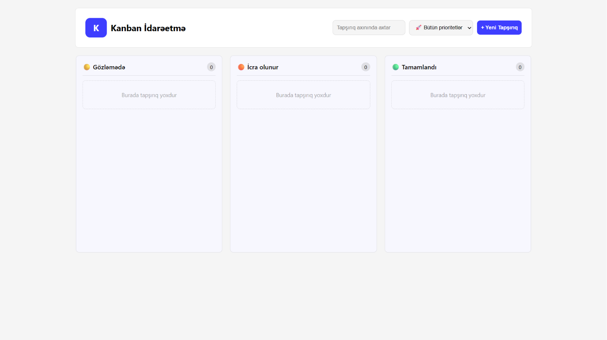

# Kanban Tapşırıq Lövhəsi

JavaScript istifadə edilərək hazırlanmış Kanban tipli tapşırıq idarəetmə tətbiqi

## Xüsusiyyətlər

- Tapşırıq əlavə et
- Tapşırığı redaktə et
- Tapşırığı sil
- Drag and Drop
- localStorage ilə yadda saxlama
- Axtarış
- Prioritet üzrə filter
- Təkrarlanan tapşırıqların qarşısının alınması

## İstifadə olunan texnologiyalar

- HTML
- CSS
- JavaScript

## Layihəni işə salmaq

1. Repositoriyanı klonlayın

```bash
git clone https://github.com/humbeteli/kanban
```

2. Qovluğa daxil olun

```bash
cd kanban
```

3. `index.html` faylını brauzerdə açın.

## Canlı Demo

[](https://kanban-sage-seven.vercel.app/)

## Ekran görüntüləri

### Desktop



### Mobile

